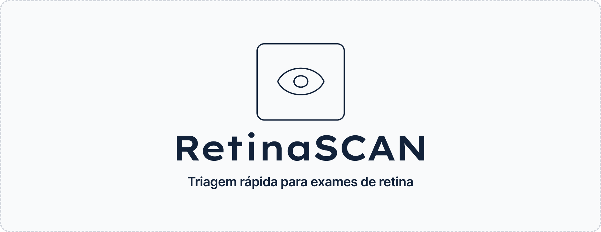

<div align="center">
    <p align="center">
    
    </p>

# 2026.1 RetinaScan Web


O **RetinaScan Web** é a interface web da plataforma RetinaScan, um sistema de triagem de retinografias utilizando Inteligência Artificial para auxiliar na identificação de possíveis alterações na retina.

A aplicação permite que profissionais de saúde realizem o upload de imagens de retina, que são enviadas para um backend responsável por processar as imagens e gerar um pré-relatório automatizado com auxílio de IA.

</div>

---

## Equipe

<div align="center">
  <table>
    <tr>
        <td align="center">
        <a href="http://github.com/andre-maia51">
            
            <br /><sub><b>André Maia</b></sub>
        </a>
        </td>
        <td align="center">
        <a href="https://github.com/artrsousa1">
            
            <br /><sub><b>Arthur Ribeiro</b></sub>
        </a>
        </td>
        <td align="center">
        <a href="https://github.com/cqcoding">
            
            <br /><sub><b>Ceci Quaresma</b></sub>
        </a>
        </td>
        <td align="center">
        <a href="https://github.com/EliasOliver21">
            
            <br /><sub><b>Elias Oliveira</b></sub>
        </a>
        </td>
        <td align="center">
        <a href="https://github.com/cwtshh">
            
            <br /><sub><b>Gustavo Costa</b></sub>
        </a>
        </td>
    </tr>
    <tr>
        <td align="center">
        <a href="https://github.com/Angelicahaas">
            
            <br /><sub><b>Harleny Angelica</b></sub>
        </a>
        </td>
        <td align="center">
        <a href="https://github.com/IderlanJ">
            
            <br /><sub><b>Iderlan Junio</b></sub>
        </a>
        </td>
        <td align="center">
        <a href="https://github.com/Natyrodrigues">
            
            <br /><sub><b>Natália Rodrigues</b></sub>
        </a>
        </td>
        <td align="center">
        <a href="https://github.com/vnsrz">
            
            <br /><sub><b>Vinicius Roriz</b></sub>
        </a>
        </td>
        <td align="center">
        <a href="https://github.com/yan-luca">
            
            <br /><sub><b>Yan Luca</b></sub>
        </a>
        </td>
    </tr>
  </table>
</div> 

---

##  Tecnologias Utilizadas
- React
- TypeScript
- Vite
- Docker
- Docker Compose


---

## Requisitos

Antes de executar o projeto, é necessário possuir instalado:

- Docker
- Docker Compose

Verifique as instalações com:

```bash
docker --version
docker compose version
```

---

## Executando o Projeto

Para iniciar o ambiente de desenvolvimento:

```bash
sudo docker compose -f docker-compose.dev.yml up -d --build
```

### O comando irá:

- Construir a imagem do frontend
- Iniciar os containers necessários
- Subir o ambiente de desenvolvimento

---

## Acessando a Aplicação

Após iniciar os containers, a aplicação estará disponível em:

```txt
http://localhost:5173
```

---
## Licença

Este projeto está licenciado sob a licença MIT. Veja o arquivo [LICENSE](LICENSE) para mais detalhes.
